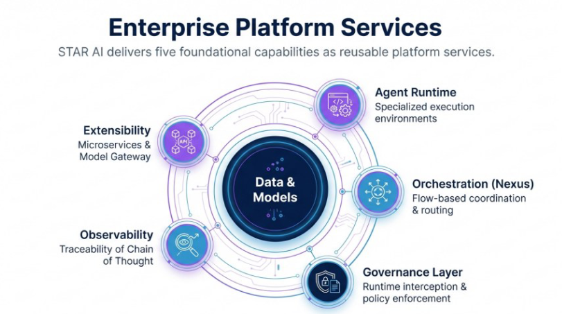
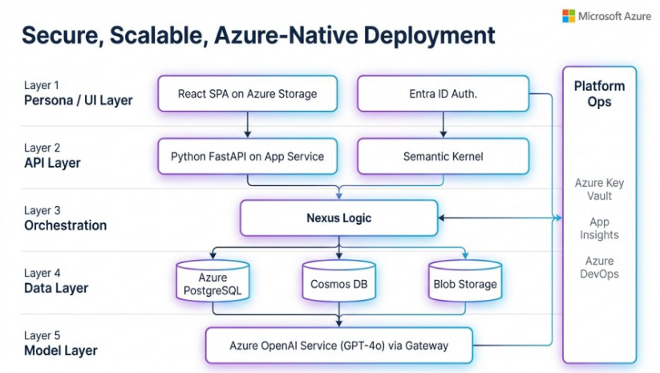

# Architecture

Agentic AI is implemented as a **layered system of intelligence**, not a single model or tool.

Each layer has a distinct responsibility and clear control boundaries.

---

## Enterprise Platform Services

Agentic AI delivers foundational capabilities as **reusable platform services**:

- Agent runtime environments
- Flow-based orchestration
- Embedded governance layer
- Observability and traceability
- Extensibility via APIs and gateways

At the center are **data and models**, surrounded by execution, control, and visibility.

**For CTOs:**  
This is a platform you can standardize on.

**For architects:**  
These services can be composed into multiple solutions without rework.

---

## Logical Architecture Layers

### Interaction Layer
- User interfaces
- Task initiation
- Review and approval surfaces

### API Layer
- Secure service endpoints
- Authentication and authorization
- Request mediation

### Orchestration Layer
- Agent sequencing and coordination
- State management
- Conflict resolution and escalation

### Intelligence Layer
- Language models
- Retrieval and embedding services
- Domain-specific evaluators

### Governance Layer
- Policy enforcement
- Runtime interception
- Audit and traceability services

### Data Layer
- Original document storage
- Structured metadata
- Vector stores for semantic retrieval

---

## Multi-Agent Coordination Model

- Intent-based routing
- Parallel execution where safe
- Supervisor escalation for conflicts
- Persistent state tracking across workflows

---

## Deployment Architecture

Agentic AI is designed for **secure, scalable, cloud-native deployment**, including:

- Identity-based access control
- Encrypted data storage
- Platform operations (monitoring, secrets, CI/CD)
- Separation of runtime, data, and model layers

---

## Architectural Principles

- Human authority is preserved
- Autonomy is contextual, not absolute
- Every decision is observable
- Governance is architectural, not procedural

 ---
 ## Secure, Scalable, Cloud-Native Deployment

Agentic AI is deployed as a layered, cloud-native platform with clear separation of responsibilities:

- **Persona / UI Layer** – User interaction and role-based access
- **API Layer** – Secure service interfaces
- **Orchestration Layer** – Flow-based agent coordination
- **Data Layer** – Structured, unstructured, and vectorized storage
- **Model Layer** – Governed access to foundation models

**For CTOs:**  
This architecture aligns with enterprise security, identity, and operations standards.

**For architects:**  
Each layer can be scaled, secured, and evolved independently.

