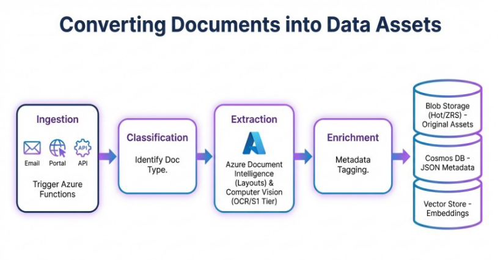
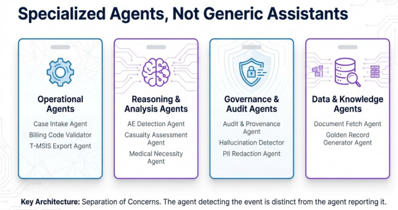

# Core Capabilities

Agentic AI is built around **capability pillars**, not autonomous outcomes.

Each capability is designed to support controlled execution, observability, and human authority.

---

## Converting Documents into Data Assets

Agentic AI treats documents as **raw material**, not final artifacts.

The pipeline includes:
1. Ingestion from multiple channels
2. Classification to identify document type
3. Extraction using document intelligence and OCR
4. Enrichment with metadata and semantic context
5. Storage across original assets, structured metadata, and embeddings

**Why this matters:**  
Downstream agents reason over **data**, not PDFs.

---

## Ingestion & Data Foundations

- Multi-channel ingestion (email, portals, APIs)
- Structured document intake and classification
- Conversion of unstructured content into usable data assets
- Separation of original assets, metadata, and embeddings

---

## Specialized Agents, Not Generic Assistants

Agentic AI is built on **separation of concerns**.

Different agents are responsible for:
- Operational execution
- Reasoning and analysis
- Governance and audit
- Data and knowledge access

**Key architectural principle:**  
The agent that *detects* an event is not the agent that *reports* it.

This separation increases reliability, auditability, and trust.

---

## Agent Runtime

- Purpose-built execution environments for agents
- Isolation of agent responsibilities
- Deterministic execution boundaries
- Support for parallel and sequential processing

---

## Orchestration

- Flow-based coordination of agents
- Intent-based task routing
- Parallel execution where appropriate
- State-aware workflow progression

The orchestrator governs *how* and *when* agents act.

---

## Governance & Observability

- Runtime policy enforcement
- Confidence scoring and decision thresholds
- Full traceability across agent actions
- Evidence-linked outputs

Governance is enforced **during execution**, not after the fact.

---

## Extensibility

- API-first design
- Pluggable agent patterns
- Integration with enterprise platforms and services
- Support for staged handoffs to specialized systems
