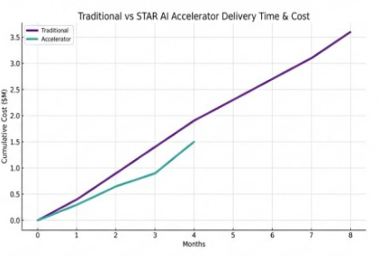

# Getting Started

This section outlines how organizations typically begin with Agentic AI.

---

## Who This Is For

- Teams operating in regulated environments
- Organizations scaling beyond chat-based AI
- Programs requiring defensible automation

---

## Typical Entry Points

- Targeted proof of value
- Pilot workflow embedded in an existing process
- Platform deployment with a limited agent set

---

## Platform Acceleration vs Traditional Delivery

This comparison illustrates the difference between deploying Agentic AI as a **platform accelerator** versus building from scratch.

**Key takeaway for executives:**
- Traditional approaches accumulate cost linearly with time
- The accelerator model front-loads platform setup and compresses delivery timelines
- Teams reach production earlier with lower cumulative investment

Agentic AI is designed to be deployed as a **day-zero platform asset**, not a disposable proof of concept.

---

## Week 1 Focus

- Identify candidate workflows
- Define decision boundaries
- Establish governance roles
- Deploy baseline platform components

---

## What Comes Next

- Incremental expansion of agent capabilities
- Introduction of additional workflows
- Progressive increase in automation with preserved controls
